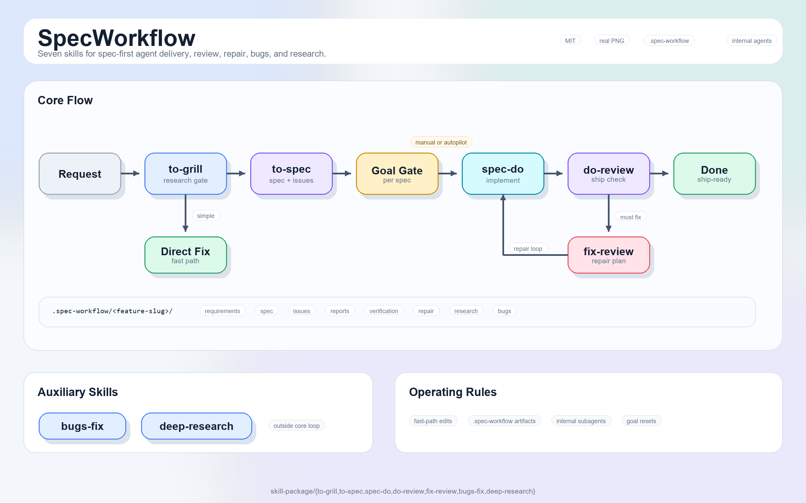

# SpecWorkflow

[English](README.md) | 中文

SpecWorkflow 是一套可分享的 workflow skill pack，面向 DeepSeek Harness 和其它兼容 Agent Skills 的工具。它给 Agent 一条清晰路径：从粗糙需求开始，推进到需求澄清、实施规格、代码执行、交付检查、修复规划、bug 诊断和带来源的调研。

它不会把每个请求都拖进重流程。简单明确的修改可以直接处理；需求模糊、跨模块、影响产品体验、数据、权限、接口或发布风险的工作，才进入完整 workflow。



## 功能

| 阶段 | Skill | 处理内容 |
| --- | --- | --- |
| 调研 | `deep-research` | 基于官方文档、API、标准、源码等一手来源做调研。 |
| 1 | `to-grill` | 需求质询、消除歧义、风险审查，并判断直接实施还是进入完整流程。 |
| 2 | `to-spec` | 编写可实施 spec、修订说明、验收标准、验证计划和可选 tickets。 |
| 3 | `spec-do` | 根据已批准的 spec、issue、修订或修复计划进行实施。 |
| 4 | `do-review` | 对照需求、spec、代码和证据做最终交付检查。 |
| 5 | `fix-review` | 把 must-fix review findings 转成修复 spec 和修复 tickets。 |
| 调试 | `bugs-fix` | 针对 bug、回归和性能问题做复现、根因定位、修复和证据留存。 |

## 要求

- DSH 安装方式需要 DeepSeek Harness `dsh@0.1.0-rc.6` 或更高版本。
- 完整 workflow 需要一个仓库工作区，因为产物会写入 `.spec-workflow/<feature-slug>/`。
- 其它 Agent 需要支持读取 `skill-package/*/SKILL.md` 的 Agent Skills loader。

## 安装

### DSH

```sh
dsh plugin --profile web add specworkflow
dsh web
```

如果你使用的不是 `web` profile，把 `web` 换成实际 profile。

如果需要安装尚未发布的改动，或需要可审计的 GitHub 快照：

```sh
dsh plugin --profile web add github:MoonCoder-HAPPY/SpecWorkflow
```

需要固定精确源码时，可以指定 commit：

```sh
dsh plugin --profile web add github:MoonCoder-HAPPY/SpecWorkflow#<commit>
```

### 其它 Agent

把这段交给你的 Agent：

```text
把 https://github.com/MoonCoder-HAPPY/SpecWorkflow 的 skill-package/* 安装到当前 Agent 工具可识别的项目级 skills 目录中。保持目录名不变。
```

如果只想在当前项目使用 SpecWorkflow，就安装到项目级目录。

## 快速开始

典型功能开发：

```text
使用 to-grill 澄清这个需求，需求收口后再进入 to-spec。
```

简单修改保持简单：

```text
把表格字体调大一点。
```

这类请求应该直接实施，不应该强行进入五阶段流程。

## 工作流

读图时按从左到右理解。上方是直接实施分支，中间是完整 spec 流程，下方是 review 后的修复闭环。

```text
to-grill -> to-spec -> spec-do -> do-review -> fix-review -> spec-do repair -> do-review
```

`to-grill` 是模糊或高风险工作的入口。它读取用户需求、仓库上下文和已知约束，判断任务应该直接处理，还是进入完整 workflow。进入后，它会把需求探索结论写入 `.spec-workflow/<feature-slug>/requirements.md`。

`to-spec` 把已经收口的需求整理成可实施 spec。它补齐范围、非目标、数据语义、权限、交互行为、验收标准、风险和验证方式。如果是在调整已有 spec，它会先写修订与影响说明，再继续实施。

`spec-do` 根据已批准的 spec、tickets、修订或修复计划实施。写代码前，它会处理分支选择、脏工作区检查和是否自动提交。实施中不能 mock 系统业务逻辑；验证证据和实施记录都围绕当前 feature 目录保存。

`do-review` 判断当前工作是否真的可交付。它不扩大 scope，也不改代码。只要存在 must-fix finding，就进入 `fix-review`。

`fix-review` 把 must-fix findings 转成修复 spec 和可选修复 tickets。修复计划回到 `spec-do` 实施，再回到 `do-review` 复查，直到可交付或需要人工决策。

`deep-research` 和 `bugs-fix` 是支线。外部事实会影响判断时，用 `deep-research`；失败、回归和性能问题，用 `bugs-fix`。

Goal Mode 只对当前 spec 生效，且必须由用户显式选择。启用后，Agent 可以自动串联实施、review、修复规划、修复实施和再次 review；遇到目标完成、修复预算耗尽，或产品、安全、git、验证、环境、scope 决策时停止。

## 目录产出

SpecWorkflow 把 workflow 文件放在 `.spec-workflow` 下，避免把项目代码和 Agent 证据混在一起。

```text
.spec-workflow/<feature-slug>/
  requirements.md
  spec.md
  issues/
  amendments/
  implementation/
  review/
  repair-spec.md
  repair-issues/
  verification/
  debug/
  bugs/
  research/
```

项目长期测试仍然放在项目原本的测试目录，不放进 `.spec-workflow`。

## 边界

- SpecWorkflow 不替代产品判断。用户选择会先从合理性、安全、权限、性能、可维护性、范围匹配、验证成本和可逆性等角度审核，再继续执行。
- 简单低风险修改不应该被强制进入完整 workflow。
- 实施阶段不能为了让测试通过而 mock 真实系统业务逻辑。
- Goal Mode 必须由用户显式选择，且只作用于当前 spec。
- DSH 包只注册 skill provider，不注册模型工具、不管理凭据，也不加入常驻后台服务。

## 包结构

```text
skill-package/
  to-grill/
  to-spec/
  spec-do/
  do-review/
  fix-review/
  bugs-fix/
  deep-research/

index.mjs
cordis.patch.yml
package.json
```

在 DSH 中，`index.mjs` 会通过原生 `FileSystemSkillProvider` 注册 `skill-package/`。在其它 Agent 中，`skill-package/` 下每个目录都是一个独立 Agent Skill，包含自己的 `SKILL.md`。

## 验证

安装到 DSH 后运行：

```sh
dsh --profile web --dump-config
```

组合配置里应该出现：

```text
# == specworkflow
- id: specworkflow
  name: specworkflow
```

也可以直接询问 Agent 当前有哪些 SpecWorkflow skills，以及什么时候使用 `to-grill`。

## 卸载

```sh
dsh plugin --profile web remove specworkflow
```

把 `web` 换成你实际安装的 profile。

## 许可证

MIT. See [LICENSE](LICENSE).
